# Introduction
The goal of this task is to develop and evaluate three regression models to predict the housing prices in three Melbourne suburbs. The selection of three suburbs on which to collect housing data was left to each student to decided. The chosen suburbs for this work were:

 * Berwick
 * Officer
 * Pakenham


# Melbourne Housing Data acquisition
 Data collection leveraged [realestate.com.au](https://realestate.com.au/) using the process described below. The goal was to obtain at least 150 data points (50 for each suburb). As the number of data points is low to provide sufficient points per month to resolve annual seasonal patterns, it was decided to focus on the period between January to August 2025. Two property types were considered for his task, houses and townhouses. These suburbs on the outer edge of metropolitan Melbourne and other property types such as units and apartments are not as popular and have very low sales volumes.

## Data Ethics and privacy
The data is this task is publicly available on a number of property websites and contains no personal identifying information about the sellers or buyers. The source of the data, on the other hand did raise some ethical issues. Data was sourced from the [realestate.com.au](https://realestate.com.au) website as required in the task specifications. The terms an conditions for usage of the realestate.com.au website prohibits the use of "any automated device, software, process or means to access, retrieve, scrape, or index our Platforms or any content on our websites.". Therefore, any automated approach that directly scraped data from the website would be in violation of the terms and conditions of the websites use. The approach adopted in this work involved manually perusing the website and printing the result to a PDF file. The contents of the PDF file could then be extracted automatically.

\FloatBarrier
## Data collection process
The steps involved in the data collection process were:

 1. For each of the chosen suburbs, search for sold properties. Limiting the search to only those properties with a sold price, and type of property i.e. house or townhouse and sold in the last 12 months. 
 2. For each page of the search results within the required Jan to Aug period, print to a PDF file.
 3. Combine all PDF documents for each suburb and property type into a single PDF file.
 4. Process the PDF using the created Python code. The steps of the python code are:

    a. Read the PDF file using the pymupdf package.

    b. For every page in the document extract the text and join the text together in a large single string.

    c. Use a regular expression patterns to split the full text into a list of blocks. The regular expression pattern looked for new line character followed by a dollar sign ($). This signifies the start of a listing block.

    d. Define regular expression patterns to identify the price, address, property details such as number of bedrooms, bathrooms, car spaces and land size, sold date, and property type.

    e. For each listing block of text find all text that matches the patterns in (step d). 

    f. For all the found patterns, process them and store them into a dictionary for this listing. Appending the dictionary to a list of listings.

    g. After all of the listing blocks have been processed, convert the listings list into a DataFrame.

    h. Check for and handle missing data. Some real estate listing do not include the land size. Rather than skipping these, it was decided to included them and then impute the missing land size from the median. Since townhouses have a much lower median land size than houses, the imputation of missing land size was done per property type. 

    i. Store the DataFrame for the suburb.


A total of three DataFrames were obtained after executing the above process, one for each suburb. Since the data was extracted to cover the period January to August 2025, each DataFrame contained more than the required number of data points as shown in the table below.

```python
          Total Sales
Berwick           507
Officer           340
Pakenham          672
```

Two options were considered for selecting the number of data points for model development from the larger set of data. 

### Option 1: Equal Sampling from each suburb
- **Pros**:
  - Ensures balanced representation.
  - Prevents the model from being biased toward suburbs with more data.

- **Cons**:
  - May underutilise available data if some suburbs have many more sales.
  - Might miss out on capturing variability in suburbs with more data.

### Option 2: Proportional Sampling Based on Sales Ratios
- **Pros**:
  - Utilises more data, potentially improving model accuracy.
  - Reflects real-world distribution of housing sales.

- **Cons**:
  - Risk of model bias toward suburbs with more data.
  - Requires stratified sampling in test/training splitting to ensure fairness.

The chosen strategy was to use option 1 with 60 data points from each suburb. The 60 samples were chosen, as it was observed that later processing where the address is turned into geolocation data, some address were not valid for geolocation and therefore were removed from the data. Taking 60 samples ensures that after removing invalid addresses, there were still at least 50 from each suburb. 

```python
          Total Sales  Number of Samples
Berwick           507                 60
Officer           340                 60
Pakenham          672                 60
```
The volume of townhouse sales in each of the suburbs was much lower than houses. Stratified sampling was employed to keep the ratio of houses to townhouses in the samples from each suburb.  

Figure \ref{fig-1} shows the proportion of property types across the suburbs for the original and sampled data, illustrating the sampling approach has maintained the proportions.

\centering
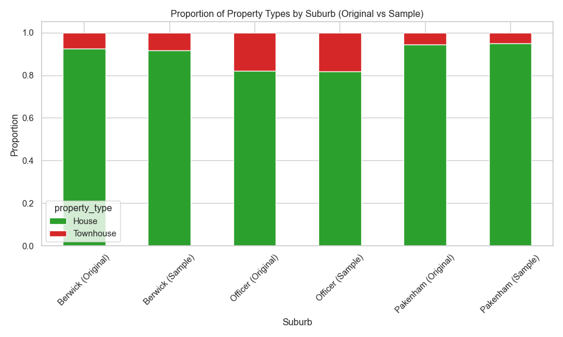
\raggedright
\flushleft

\FloatBarrier
# Data preprocessing and exploratory data analysis

## Feature engineering
Additional features are added to the already collected data. The additional features considered in this work are:

* The number of primary and secondary schools within an 1.5 km radius. School zones in Melbourne are a major driver of property prices [[1]](https://amru.org.au/latest-news/australian-house-price-factors/). Families often pay significant premiums to live within the catchment areas of top-performing public schools [[2]](https://www.findamover.com.au/blog/melbourne-school-zones-impact-property-values-moving-decisions
).
* The number of child care services within an 1.5 km radius. Access to childcare is essential for working families. Areas with more childcare options are more attractive to young parents, increasing demand and prices.
* The distance to the nearest training station and bus stop. Public transport access significantly boosts property values, especially in suburbs connected to new infrastructure [[3](https://www.realestate.com.au/news/how-do-public-transport-links-affect-property-prices/), [4](https://www.raywhite.com/news-and-market-insights/economic-updates/what-is-the-impact-of-transport-infrastructure-on-house-prices)]. Access to public transport is very important in the outer suburbs like those considered in this work as many people have to commute into the inner suburbs/city for work and would rather do this on a train than be stuck in a car for hours.
* The distance to the nearest shopping centre. Shopping centres provide convenience and lifestyle amenities. Proximity boosts desirability, especially in suburban areas [[1](https://amru.org.au/latest-news/australian-house-price-factors/), [5](https://www.goldenagegroup.com.au/journal/a-retail-boom-major-shopping-centres-provide-property-price-boost/)].
* The distance to the nearest park. Parks enhance quality of life, offering recreational space and greenery. They are especially valued by families and retirees [[6]](https://conveyancinggroup.com.au/resources/understanding-property-valuation-key-factors-influencing-house-prices-in-australia).
* The month of the year sold as cosine and sine. Seasonality affects housing prices [[7]](https://www.monash.edu/business/economics/research/publications/publications2/5315seasonalityunitpricesaladkhaniworthingtonsmyth.pdf). Using sine and cosine transforms captures cyclical patterns without introducing discontinuities and was especially important for this work where only 8 month of data is used for the modelling. Predictions for months 9-12 would not be possible if the month was one-hot encoded but is possible for the cyclic cosine/sine encoding.
* The day of the week sold. While subtle, the day of sale can reflect market dynamics (e.g., weekend auctions vs. weekday private sales), which may influence price outcomes.
* The number of days since January 1st 2025. This feature captures temporal trends and market evolution over time, including interest rate changes, inflation, and market sentiment. It helps the model learn price trajectories and macroeconomic influences.

The first six features require the geographic location for each property and converts it into features that might be meaningful for buyers. The last three feature helps include the sold data information into the models by including a time based features. Prices today are most likely different from prices weeks or month ago.

A 1.5 km radius for features like proximity to schools and childcare was chosen because:

* Walkability and Accessibility. A 1.5 km = ~15–20 minutes walking distance is considered a comfortable walk for most people [[8]](https://vpa.vic.gov.au/wp-content/uploads/2018/02/Open-Space-Network-Provision-and-Distribution-Reduced-Size.pdf). 
* Modelling Considerations. A 1.5 km radius balances data richness and noise reduction:
  - Smaller radii (e.g., 500 m) may miss relevant amenities.
  - Larger radii (e.g., 3 km) may dilute the local influence and introduce unrelated features.
* School Catchment Zones. School zones in Melbourne vary but often extend up to 1.5 km, especially in densely populated areas.

Each of these features requires additional data and processing steps. These are discuss in the following sections.

### Obtaining latitude and longitude
The geopy package is used to obtain the latitude and longitude of a location. Geopy provides a client interface for several popular geocoding web services. The Nominatim web service was utilised as it is free. Nominatim uses OpenStreetMap data to find locations on Earth by name and address. The only limitations found were that it required only one request per second and could time out. A time-out value of 60 seconds was found to work.

Two functions were created, geocode_addresses() and geocode_address(), this first operates on DataFrames and calls the second function to convert the address into a latitude/longitude tuple. For efficiency, the data is saved into a CSV file so if the function is run multiple times it will only process the data once and read it from the saved data for subsequent calls.

### Helper functions for distance calculations
Several functions calculate_distances_from_point(), count_entities_within_radius(), add_entity_counts_to_dataframe() were created to help with processing distances and counting the number of entities within a given distance. Further details regarding these functions can be found in their documentation and comments in the Jupyter notebook.

**calculate_distances_from_point** algorithm

1. Loop through rows from the input DataFrame.

    * Create a point from the latitude and longitude.
    * Use geopy to calculate the distance between the point and the reference point (property address).
    * Store the distance in a list.
2. Copy input input DataFrame.
3. Add list of distances as a column in the copied input DataFrame.
4. Drop all distances greater than 25 km.
5. Sort by distance.
6. Return.

**count_entities_within_radius** algorithm

1. Call calculate_distances_from_point function to get a DataFrame of entities within 25 km of the reference point.
2. Filter the entities by the required radius.
3. Count the number of entities remaining after the filtering.
4. Store the count.
5. Return result.

**add_entity_counts_to_dataframe** algorithm

1. Copy property DataFrame.
2. Loop through each row in the DataFrame

    * Call count_entities_within_radius function with thr require radius.
    * Add count as a column for this row
3. Return DataFrame.

### Schools and Childcare
To determine the number of schools within a given radius of a property, required the address locations for schools. The [Victoria Government Schools Locations 2024](https://discover.data.vic.gov.au/dataset/school-locations-2024/resource/a70cb615-ed28-48b6-bebe-2d0d346f7927) dataset was used for this purpose. The data loading, clean-up and storage was encapsulated in the Python class VictiorianSchoolLocator. The dataset contained latitude and longitude locations for every school in Victoria. To speed-up subsequent calculations, the schools were filtered by postcode, and only those in postcodes neighbouring the suburbs of interest were retained. After the data is loaded and cleaned, it is processed to classify the school types as either primary or secondary. Then the add_entity_counts_to_dataframe() function is called to count the number of each school type is within the provided radius for each property in the DataFrame and return the counts as additional columns. 

For childcare services, the dataset from the [ACEQA](https://www.acecqa.gov.au/resources/national-registers) national register of child care services was utilised. This dataset did not contain geolocation information, so this had to be generated using the geocode_addresses() function that was previously created. The loading, cleaning and storing was contained within the VictorianChildCareLocator Python class.

### Public transport
Two types of public transport were considered, the first was the distance to the nearest train station and the second was the distance to the nearest bus stop. To determine the distance between a property and train stations and bus stops, required the address locations for train stations and bus stops. The [Victoria Government Public Transports Stops](https://discover.data.vic.gov.au/dataset/public-transport-lines-and-stops/resource/afa7b823-0c8b-47a1-bc40-ada565f684c7) dataset was used for this purpose. This dataset was in geojson format and required some cleaning to extract the required information. Unlike the schools dataset, this did not contain postcodes to filter the data with. It did contain latitude and longitude information, so the data was filtered by the latitude and longitude around a given point. The point chosen was for the centre of Officer with a 15 km, radius. This ensure that all public transport stops for Berwick and Pakenham remained in that dataset. All of the data loading.clean, processing and distance calculations are contained in functions that are encapsulated in a Python class VictorianPublicTransportLocator. 

**find_closest_stop** algorithm

1. Call calculate_distances_from_point function to get a DataFrame of distances for all stops to the given reference point.
2. Filter stops to those within 15km.
3. Remove rows with duplicate stop names.
4. Classify stops as training or bus.
5. For bus and train stops find the closest to the reference point.
6. Return the result.

**add_pt_distance_to_dataframe** algorithm

1. Copy the DataFrame.
2. Loop through all rows in DataFrame
    * Call find_closest_point function.
    * Add result to column
3. Return updated DataFrame.

### Shopping and parks
There were no existing datasets that contained the location information of the shopping centres and parks within the three suburbs. Google Earth was used to create a list of parks and shopping centres within each of the three suburbs. These lists were then exported from Google Earther and partially cleaned using Microsoft Excel and exported as CSV. The final cleaning the CSV file was performed in Python, resulting is two CSV files, one containing park data and the other shopping centre data. These CSV files can then be loaded and used to calculate the minimum distance to shopping centres and parks for each property.

### Date 
There are many features that could be engineered from the sold date. The features used in this work are:

* The month of sale (as cosine and sine) to capture seasonal patterns,
* The day of the week to capture the behavioral timing,
* The number of days since January 1st to capture temporal trends.

### Drop unnecessary columns
Here the columns that are not features or the target are dropped. The columns dropped are "address", "sold_date", "latitude", "longitude" and "coords". That leaves 17 features, "suburb", "bedrooms", "bathrooms", "car_spaces",
"land_size", "property_type", "primary_sch_count", "secondary_sch_count", "childcare_count","bus_stop_distance",
"train_stop_distance", "park_distance", "shopping_centre_distance", "month_cos", "month_sin", "day", "elapsed_days".

### Exported data
The data generated from the above processing can be found at https://github.com/dwstephens/SIT720-T8_2D/blob/main/red_data.csv.


\FloatBarrier
## EDA
### Numerical features
Histograms (figure \ref{fig-2}) and box plots (figure \ref{fig-3}) of each numerical feature are shown below.

\begin{figure}[htb]
    \centering
    \includegraphics[width=0.85\textwidth]{images/num_distributions.png}
    \caption{Histograms showing the distributions of the numerical features\label{fig-2}}
\end{figure}


Many of the features contain outliers, such as land size, bathrooms and car spaces. Some of the features also had moderate positive skew, such as, land size, bus stop distance, park distance and shopping centre distance. 

\begin{figure}[htb]
    \centering
    \includegraphics[width=0.85\textwidth]{images/num_boxplots.png}
    \caption{Box plots for the numerical features \label{fig-3}}
\end{figure}

\FloatBarrier
### Categorical features
Bar plots of each categorical feature are shown below in figure \ref{fig-4}. The day of sale showed a uniform distribution except for Sunday and Friday where sales are low. As already explain, houses were the dominant property type.

\centering
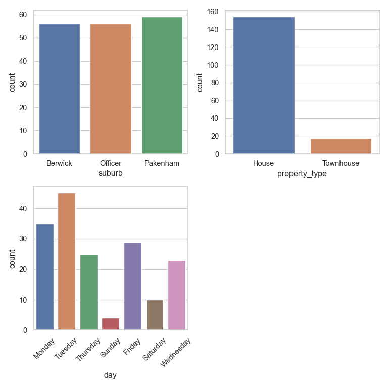
\raggedright
\flushleft

\FloatBarrier
### Distribution of property prices
Figure \ref{fig-5} shows the distribution of property prices across the three suburbs combined. The distribution of prices for townhouses is follows a standard normal distribution, where as the prices of houses has a positive skew due to a few high prices. Both distributions contained outliers at higher prices. For this work no transformation of the target variable was applied. Future improvements should look at a log transformation to reduce the distribution skewness. Figure \ref{fig-5a} shows the distribution of property prices separately for each suburb. Berwick has the highest median price, Pakenham has the lowest median price and Officer is in between Berwick and Pakenham. Distributions for all three suburbs have outliers and positive skew.

\centering
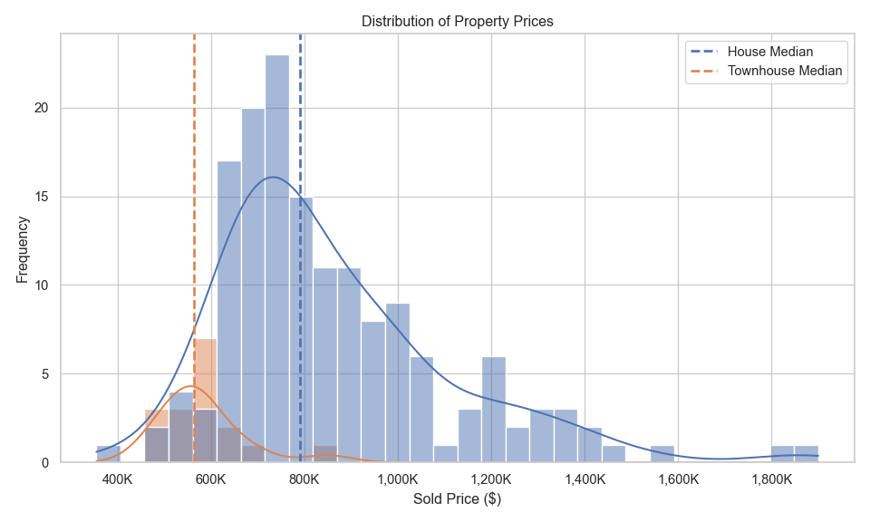
\raggedright
\flushleft

\centering
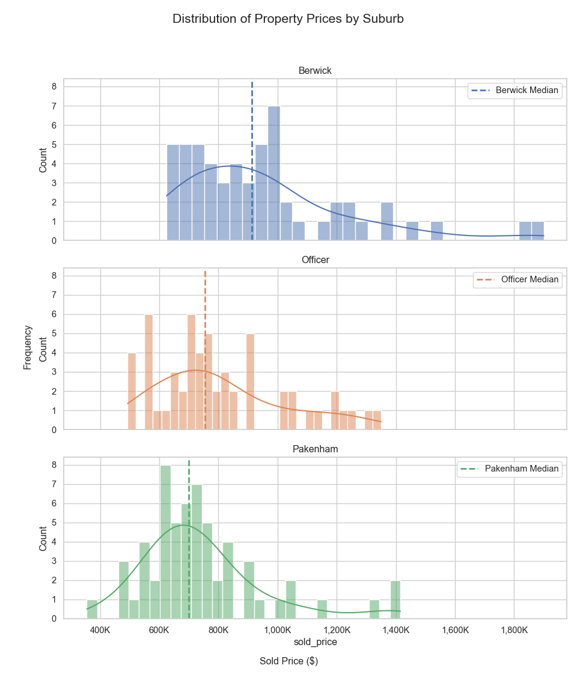
\raggedright
\flushleft

\FloatBarrier
### Price trends over time
Figure \ref{fig-6} shows the mean property price trends over time by property type for all three suburbs. The house prices have been falling from January to a low in June, then rising again. Townhouses prices have been rising steadily since January and surged since July.

\centering
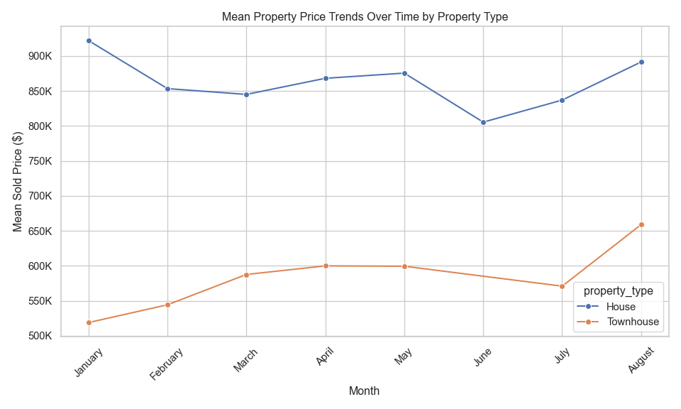
\raggedright
\flushleft

Figure \ref{fig-7} takes the information in figure \ref{fig-6} and breaks it into sub-figures for each suburb. This shows Berwick prices were high early in the year and had a low in June and a rising again. Officer house prices show large variation and Pakenham has an underlying upward trend with some shap dips in February and July. Sales for townhouse have not occurred in all months. Townhouse prices are rising in Officer and falling in Berwick and Pakenham.

\centering
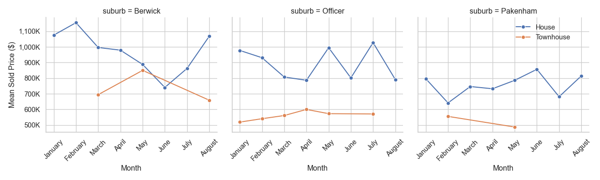
\raggedright
\flushleft

\FloatBarrier
### Target versus Feature correlation
Figure \ref{fig-8} shows scatter plots of the sold price versus each numerical feature. Additionally the Pearson correlation coefficient has been added to each figure to quantify the strength of the linear relationship between each variable pair.

\begin{figure}[htb]
    \centering
    \includegraphics[width=0.63\textwidth]{images/features_vs_sold_price.png}
    \caption{Scatter plots of the sold price versus each numerical feature \label{fig-8}}
\end{figure}


The below listing shows that categorisation of the strength of the linear relationship between each feature and the sold price. There are no very strong linear relationships, however a number of strong and moderate and many very weak linear relationships.

**Very strong** $(0.8<|R^2|<=1.0)$

  * No features

**Strong** $(0.6<|R^2|<=0.8)$

  * Land size

**Moderate** $(0.4<|R^2|<=0.6)$ 	

  * Number of bedrooms
  * Number of bathrooms

**Weak** $(0.2<|R^2|<=0.4)$

  * Number of car spaces

**Very weak** $(0.0<=|R^2|<=0.2)$	

  * Number of primary schools
  * Number of secondary schools
  * Number of child care services
  * Bus stop distance
  * Train station distance
  * Distance to nearest park
  * Shopping centre distance
  * Days since sale 

## Split data into test and train
An 80/20 split has been used, were 80% of the data is used from training and 20% for testing.

## Encoding and Feature scaling
For consistent workflow, these steps are performed in a pipeline that is executed in the model development sections.

There are no ordinal categorical features, only nominal. Therefore, each categorical feature is encoded using One-Hot encoding. The dummy variables created with One-Hot encoding can create multicollinearity between the dummy variables. This can cause trouble for some regression models and therefore, when appropriate for the model, the first dummy variable for each category is dropped.

The numerical features are all scaled with the standard scaler.

\FloatBarrier
# Model development
This task required at least three regression models to be created. The models used in this work are ElasticNet (Linear regression), kNN and Random Forest.

ElasticNet and kNN can suffer when there are highly correlated features. Figure \ref{fig-9} shows a correlation heat map for the features. Cells were the absolute value of the correlation is less than 0.5 have been removed from the plot, highlight which features show some stronger correlation. Dropping the first dummy feature from the One-Hot encoding was tested for EalsticNet and kNN, however, this resulted is models with slightly larger error. Therefore all One-Hot dummy variables were retained for the final models.

\centering
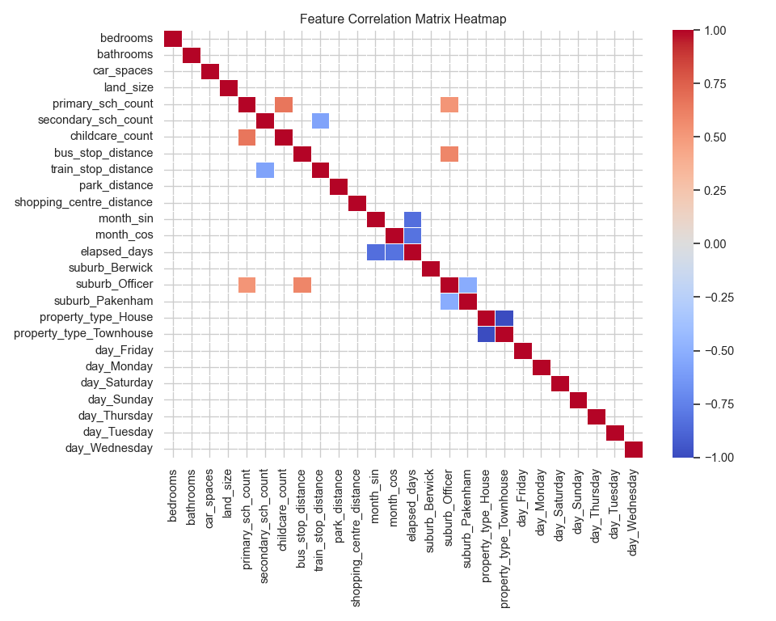
\raggedright
\flushleft

The models in this task are used to predict property prices with the goal of minimising prediction error. During hyperparameter tuning the scoring method used for the grid search is neg_mean_absolute_error. The Mean Absolute Error (MAE) was chosen as the evaluation metric because it provides a more balanced and robust measure of prediction accuracy, especially in the presence of noise or outliers. MAE treats all errors equally by taking the absolute value of the difference between predicted and actual values. In contrast, Root Mean Squared Error (RMSE) squares the errors, which amplifies the impact of large errors. This made RMSE overly sensitive to a few noisy data points in the dataset, skewing the overall performance evaluation.

\FloatBarrier
## Model 1: ElasticNet (Linear regression)
ElasticNet has been chosen to balance Ridge and Lasso regularisation and provide some feature selection.

### Hyperparameter tuning
The ElasticNet model combines both L1 (Lasso) and L2 (Ridge) regularisation, and it has a few key hyperparameters that control how it behaves. The two parameter that have been adjusted in this work are:

**alpha**: Controls the overall strength of regularisation.

  * Higher values → more regularisation (simpler model, possibly under-fitting).
  * Lower values → less regularisation (more complex model, possibly over-fitting).

**l1_ratio**: Controls the mix between L1 and L2 regularisation:

  * l1_ratio = 0 → pure Ridge (L2)
  * l1_ratio = 1 → pure Lasso (L1)
  * 0 < l1_ratio < 1 → ElasticNet mix

The best parameters identified for ElasticNet were:
```python
Best parameters: {'model__alpha': 1.0, 'model__l1_ratio': 0.9}
Best Validation Score (MAE): 107308.94
```

### Model evaluation
Figure \ref{fig-10} shows the learning curves for the ElasticNet model.

\centering
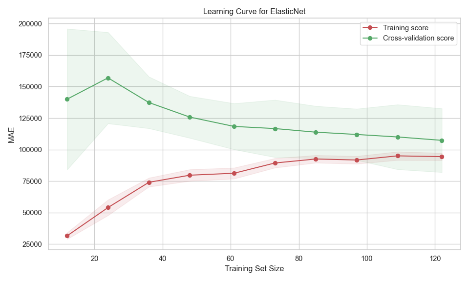
\raggedright
\flushleft

This figure shows:

* Training score (red line):
  * Starts with low MAE (good performance) on small datasets.
  * As training size increases, MAE rises and then plateaus.
  * This is expected—small datasets can be over-fitted, giving artificially low training error.

* Cross-validation score (green line):
  * Starts with high MAE (poor generalisation) on small datasets.
  * MAE decreases as training size increases, stabilising around 105,000.
  * This shows the model generalises better with more data.

* Gap between curves:
  * The gap between training and validation scores suggests some over-fitting.
  * The model performs better on training data than on unseen data, but the gap narrows as more data is added.

* Confidence intervals (shaded areas):
  * Narrow bands for training suggest more stable performance.
  * Wider bands for validation, however reaches a consistent width with larger training sizes.

Figure \ref{fig-11} shows the MAE as a function of fold number during cross validation. The model performs consistently on training data, but less reliably on unseen data. The high variance in validation scores suggests the model may not generalise well.

\centering
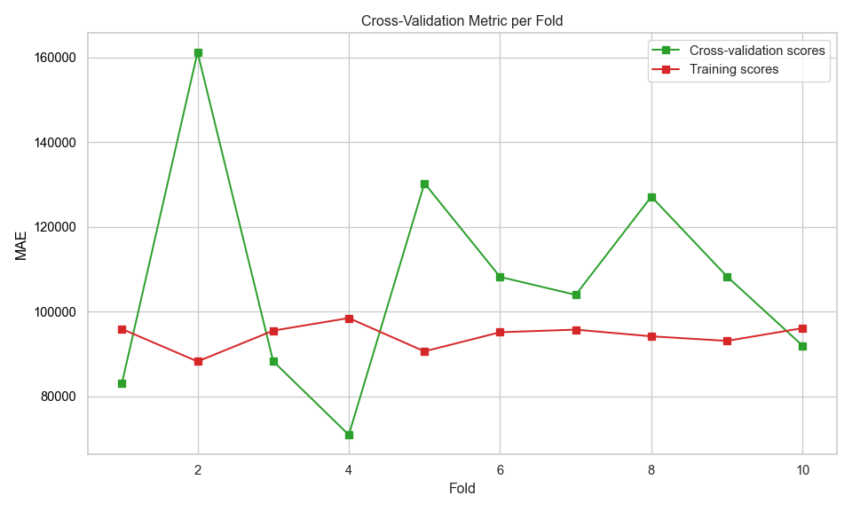
\raggedright
\flushleft

The model performance on the test set is shown below 
```python
ElasticNet performance on Test set:
R2 Score       MAE            RMSE           
0.77           79649.33       106277.19   
```

\FloatBarrier
## Model 2: k-Nearest-Neighbour
This section builds kNN model. KNN was chosen for the second model for the following reasons:

* Non-parametric and flexible: kNN doesn’t assume any underlying distribution or functional form (like linear regression does). This is useful when property prices depend on complex, non-linear relationships (e.g., location, amenities, number of schools).

* Intuitive and easy to understand: kNN predicts a house price by averaging the prices of the “k” most similar houses.

### Hyperparameter tuning
kNN has several hyper parameters 

**n_neighbors (k)**: Sets the number of neighbours to consider when making a prediction.

  * Small k → more sensitive to noise, lower bias, higher variance.
  * Large k → smoother predictions, higher bias, lower variance.

**weights**: How the neighbours contribute to the value.

  * uniform: All neighbours contribute equally.
  * distance: Closer neighbours have more influence.

**metric**: Defines how distance is calculated between points.

Figure \ref{fig-12} shows a plot of the mean absolute error as a function of the number of nearest neighbours. 

\centering
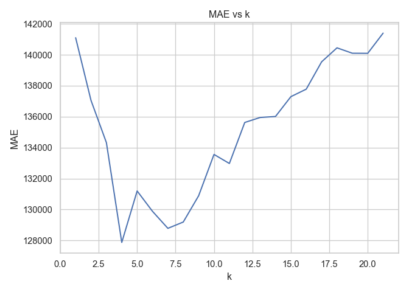
\raggedright
\flushleft

The best parameters identified for kNN were:
```python
Best k: {'model__metric': 'euclidean', 'model__n_neighbors': 4, 'model__p': 1, 'model__weights': 'distance'}
Best Validation Score (MAE): 127873.1405
```

### Model evaluation
Figure \ref{fig-13} shows the learning curves for the kNN model using the best parameters.

\centering

\raggedright
\flushleft

This figure shows:

* Training score (red line):
  * Constant at 0 MAE across all training sizes, suggests over-fitting. The model perfectly predicts the training data.
  * A zero training error is unrealistic for generalisation.

* Cross-validation score (green line):
  * Starts high (high MAE) with small training sets.
  * Decreases as training size increases — this is expected, as more data helps the model generalise better.

* Gap between curves:
  * The gap between training and validation scores suggests over-fitting.

* Confidence intervals (shaded areas):
  * Fluctuations and the validation shaded area indicate variability in performance across different validation folds — possibly due to noise or uneven distribution in the data.

Figure \ref{fig-14} shows the MAE as a function of fold number during cross validation. The model performs consistently on training data, but less reliably on unseen data. The high variance in validation scores suggests the model may not generalise well.

\centering
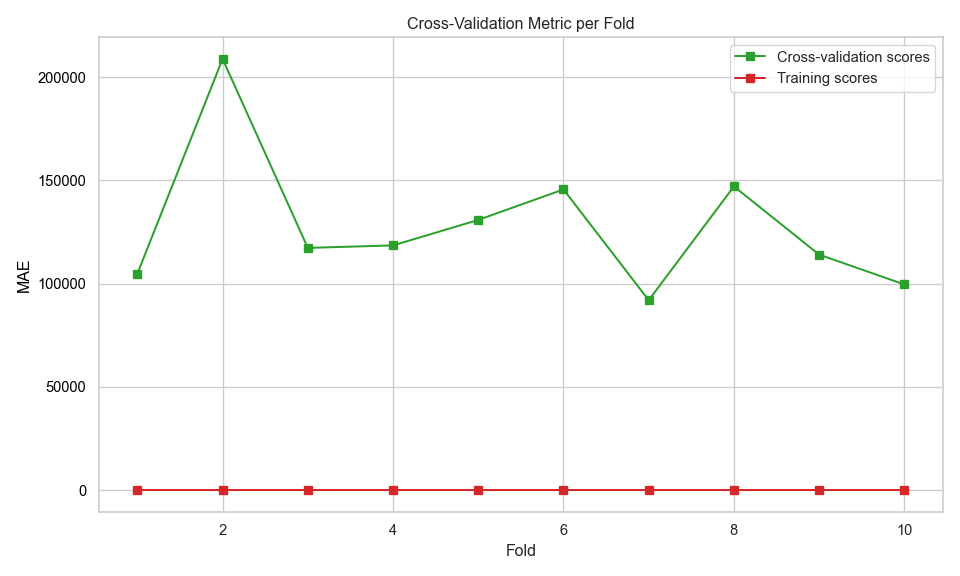
\raggedright
\flushleft

The model performance on the test set is shown below.
```python
kNN performance on Test set:
R2 Score       MAE            RMSE           
0.633          100021.53      134346.81   
```

\FloatBarrier
## Model 3: Random Forest
This section builds a random forest model. Reasons for selecting Random Forest:

* Unlike linear models (e.g., ElasticNet), Random Forest can model complex interactions between features without needing to explicitly define them.
* Each tree is trained on a random subset of the data, so outliers have less influence on the overall prediction.

* Feature importance insights: Provides estimates of feature importance.

* Good generalisation: Averaging predictions across many trees reduces over-fitting compared to a single decision tree.

### Hyperparameter tuning
The scikit learn Random Forest regressor has many hyperparameters. However, most of these relate to the underlying decision trees and those settings are concerned with pre-pruning controls. For the Random Forest model in this work, fully grown trees are used, which means that the hyperparameters relating to the decision trees can be left at their default values (no pre-pruning) and only those parameters affecting the random forest algorithm are changes. Those parameters are: 

**n_estimators**: Number of trees in the forest.

  * More trees generally improve performance but increase training time.
  * Too many trees might lead to over-fitting.

**criterion**: The function to measure the quality of a split.

**max_features**: The number of features to take into account in order to make the best split.

The best parameters identified for Random Forest were:
```python
Best Parameters: {'model__criterion': 'squared_error', 'model__max_features': None, 'model__n_estimators': 600}
Best Validation Score (MAE): 112635.7592
```

### Model evaluation
Figure \ref{fig-15} shows the learning curves for the Random Forest model using the best parameters.

\centering

\raggedright
\flushleft

This figure shows:

* Training score (red line):
  * MAE decreases as training size increases, but starts relatively low and flattens out. The model fits the training data well, and performance improves slightly with more data.

* Cross-validation score (green line):
  * MAE also decreases with more training data, showing improved generalization.
  * The model benefits from more data and is learning to generalise better.

* Gap between curves:
  * This suggests some variance, but not severe over-fitting.
  * The model is learning well and generalising reasonably.

* Confidence intervals (shaded areas):
  * As training size increases, variability decreases — a good sign of model stability.

Figure \ref{fig-16} shows the MAE as a function of fold number during cross validation. Similar to the other two models the Random Forest model performs consistently on training data, but less reliably on unseen data and exhibits a high variance in validation scores.

\centering
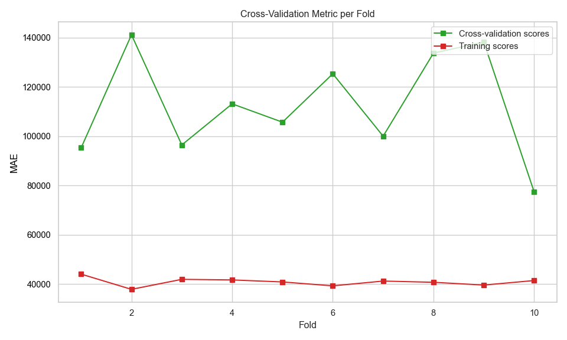
\raggedright
\flushleft

The model performance on the test set is shown below.
```python
Random Forest performance on Test set:
R2 Score       MAE            RMSE           
0.699          80013.42       121542.34  
```

\FloatBarrier
# Feature importance
Two methods were used to analyse feature importance model:

* ElasticNet and Random Forest

  * Model-Based Importance and SHAP analysis


* kNN

  * Permutation importance and SHAP analysis


**Model-Based Importance** - use inherent attribute of the model to asses feature importance. For ElasticNet, use coefficient magnitudes and for Random Forest use the Mean Decrease in Impurity (MDI).

**Permutation importance** - evaluates how much a model's performance decreases when a feature's values are randomly shuffled. If shuffling a feature significantly worsens the model's performance, that feature is considered important.

**SHAP analysis** - ensures robust statistical inference by examining feature contributions at both individual and aggregate levels, while accounting for potential non-linear effects and class-specific patterns in the data.


For reporting the Model-base and permutation importances have been grouped together and the SHAP values are reported together. 

\FloatBarrier
## Permutation/model-based importance
Figure \ref{fig-17} shows the feature importance values for each model. ElasticNet and Random forest values were calculated using model-based method and the kNN result is from permutation importance. The feature have been sorted based upon the ElasticNet importances. The bar length shows the mean importance values. The ElasticNet values are absolute values. The kNN value can be positive or negative, positive values indicate that these features contribute positively to the model’s predictive power. Negative values suggest that shuffling the feature actually improved model performance, implying it may be noise or negatively correlated with the target.

\centering
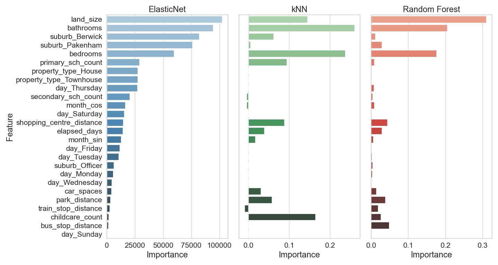
\raggedright
\flushleft

**ElasticNet** top features:

  * bathrooms
  * land_size
  * suburb_Berwick
  * suburb_Pakenham
  * bedrooms

ElasticNet gives weight to both physical property attributes and location-based features.

**kNN** top Features:

  * land_size
  * bedrooms
  * bathrooms

kNN focuses more narrowly on a few strong predictors, especially size and location.

**Random Forest** top features:

  * land_size
  * bathrooms
  * bedrooms
- Random Forest aligns closely with kNN in terms of top features, emphasising size and location.

**Key Observations**

  * land_size, bathrooms, and bedrooms are consistently important across all three models.
  * ElasticNet includes more features in its top rankings, suggesting it captures a broader range of influences.
  * Random Forest and kNN show similar patterns, possibly due to their non-linear nature and reliance on proximity or ensemble decision trees.

\FloatBarrier
## SHAP analysis importance
Figure \ref{fig-18} shows the feature importances for each model calculated from SHAP analysis.

\centering
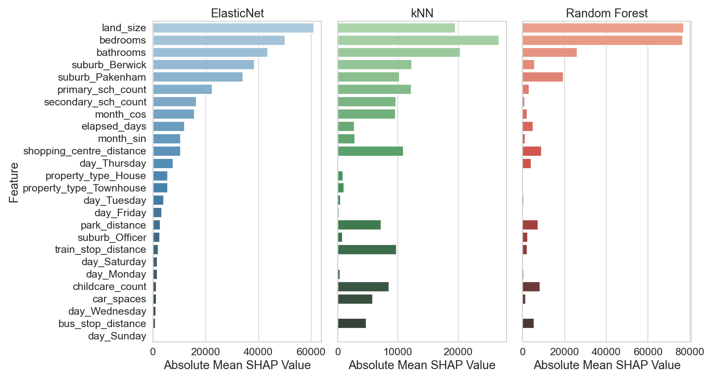
\raggedright
\flushleft

**Key Observations**

  * land_size is the most important feature across all three models, especially dominant in Random Forest.
  * bedrooms consistently ranks as a highly important feature in all models.
  * suburb_Berwick and bathrooms are also influential, though their importance varies slightly between models.
  * ElasticNet shows a more balanced distribution of feature importance, while Random Forest heavily prioritizes land_size.

## Conclusion
Based on the results shown in figures \ref{fig-17} and \ref{fig-18} the following conclusion can be made regarding the importance of various features in predicting property prices for the suburbs of Berwick, Officer and Pakenham:

  * Property size (land_size) is the strongest predictor of price.
  * Number of bedrooms and bathrooms are key indicators of property value. These are usually a good indicator of property size.
  * Location features (like suburb_Berwick and suburb_Pakenham) are important, suggesting that suburb-specific trends affect pricing. The mean price in Berwick is higher than Pakenham. Including both suburbs spans the entire price range observed in the data.
  * ElasticNet tends to distribute importance across more features, while Random Forest and KNN concentrate on fewer, high-impact ones.

\FloatBarrier
## Recommended model
Figure \ref{fig-19} shows the comparison of the MAE, RMSE and $R^2$ metrics for each model. The ElasticNet model has the highest $R^2$ and lowest RMSE. Its MAE is slightly higher than Random Forest which has the lowest value for this metric. The kNN model has the worst of all three metrics. Based on these metrics, ElasticNet is the recommended model.  

\centering
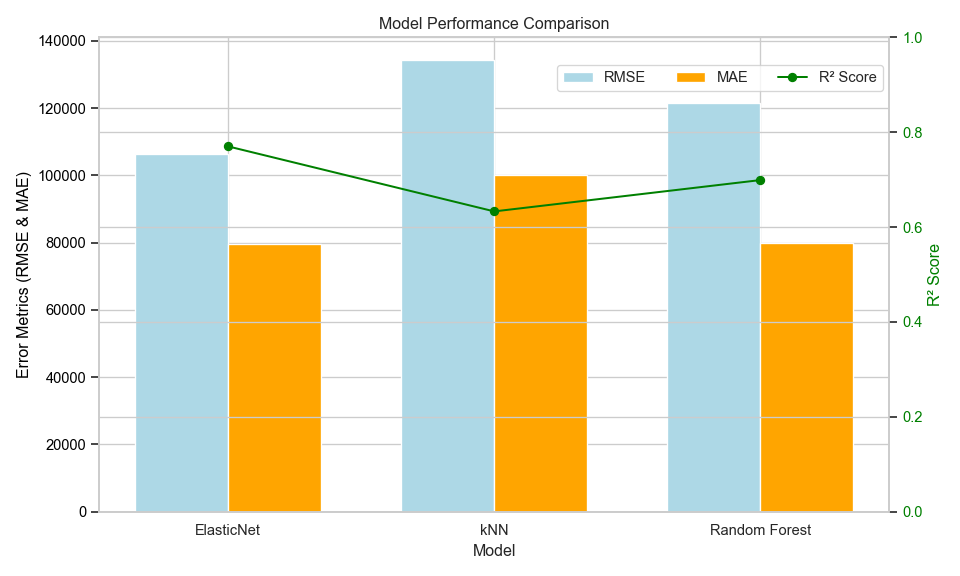
\raggedright
\flushleft


\FloatBarrier
# Model deployment
To delopy the best model, it is first saved to a file so it can be uploaded and utilised in a Streamlit web application. The code for the Streamlit app can be found below and in the GitHub repository at https://github.com/dwstephens/SIT720-T8_2D. To predict the property price using the web application, the user is required to enter the details about the property. These are the features the model was built using. To keep the application simple, the user needs to enter values for most of the engineered features as well, except for those derived from the date. The features derived from the date are calculated in the web application using a custom transformer. Encoding and scaling are performed in the pipeline encapsulated with the loaded model.

The Streamlit web application is hosted on the Streamlit community cloud and can be found at https://sit720-t82d-bdzrxstjm3nmm3v8yashcu.streamlit.app/. 

Figures \ref{fig-20} shows the web application after a prediction.

\centering

\raggedright
\flushleft


```python
import streamlit as st
import pandas as pd
import math
import json
import joblib
import folium
from datetime import date, datetime
from sklearn.base import BaseEstimator, TransformerMixin
from sklearn.compose import ColumnTransformer
from sklearn.pipeline import Pipeline
from streamlit_folium import st_folium


# -----------------------------
# Custom Transformer
# -----------------------------
class DateFeatureEngineer(BaseEstimator, TransformerMixin):
    def __init__(self, start_date="2025-01-01"):
        if isinstance(start_date, str):
            self.start_date = datetime.strptime(start_date, "%Y-%m-%d")
        else:
            self.start_date = start_date

    def fit(self, X, y=None):
        return self

    def transform(self, X):
        date_series = pd.to_datetime(X['date'])
        month_number = date_series.dt.month
        features = pd.DataFrame(index=X.index)
        features['month_sin'] = month_number.apply(lambda m: math.sin(2 * math.pi * m / 12))
        features['month_cos'] = month_number.apply(lambda m: math.cos(2 * math.pi * m / 12))
        features['elapsed_days'] = (date_series - self.start_date).dt.days
        features['day'] = date_series.dt.day_name()
        return features


# -----------------------------
# Load Model
# -----------------------------
@st.cache_resource
def load_model():
    return joblib.load("property_pipeline.joblib")

# Load the pipeline from the joblib file
loaded_pipeline = load_model()


# -----------------------------
# Column Setup
# -----------------------------
desired_order = [
    'bedrooms', 'bathrooms', 'car_spaces', 'land_size', 'primary_sch_count',
    'secondary_sch_count', 'childcare_count', 'bus_stop_distance',
    'train_stop_distance', 'park_distance', 'shopping_centre_distance',
    'month_sin', 'month_cos', 'elapsed_days', 'suburb', 'property_type',
    'day'
]

transformed_columns = [
    'month_sin', 'month_cos', 'elapsed_days', 'day',
    'bedrooms', 'bathrooms', 'car_spaces', 'land_size', 'primary_sch_count',
    'secondary_sch_count', 'childcare_count', 'bus_stop_distance',
    'train_stop_distance', 'park_distance', 'shopping_centre_distance',
    'suburb', 'property_type'
]

# -----------------------------
# Pipeline Setup
# -----------------------------
feature_engineer = ColumnTransformer(
    transformers=[
        ('date_features', DateFeatureEngineer(start_date="2025-01-01"), ['date'])
    ],
    remainder='passthrough'
)

pipeline = Pipeline([
    ('preprocessing', feature_engineer)
])


# -----------------------------
# Sidebar Inputs
# -----------------------------

# Sidebar input
st.sidebar.header("Enter Property Details")

# Top section (single column)
top = st.sidebar.container()
selected_date = top.date_input("Date",                      
    min_value=date(2025, 1, 1),
    max_value=date(2025, 12, 31)
)

# Main property info
top.header("Main Property Info")
suburb = top.selectbox("Suburb", ["Berwick", "Officer", "Pakenham"])
property_type = top.selectbox("Property Type", ["House", "Townhouse"])
bedrooms = top.slider("Bedrooms", 2, 6, 3)
bathrooms = top.slider("Bathrooms", 1, 5, 2)
car_spaces = top.slider("Car Spaces", 1, 6, 1)
land_size = top.slider("Land Size (sqm)", 90, 2200, 100)

# Middle section (two columns)
middle = st.sidebar.container()
middle.header("Nearby Education")

m_col1, m_col2, m_col3 = middle.columns(3)

with m_col1:
    primary_sch_count = st.slider("Primary Schools", 0, 5, 0)

with m_col2:
    secondary_sch_count = st.slider("Secondary Schools", 0, 2, 1)

with m_col3:
    childcare_count = st.slider("Childcare", 2, 24, 5)

# Bottom section (two columns)
bottom = st.sidebar.container()
bottom.header("Nearby Amenities")

b_col1, b_col2 = bottom.columns(2)

with b_col1:
    bus_stop_distance = st.slider("Bus Stop (km)", 0.0, 1.3, 0.5)
    park_distance = st.slider("Park (km)", 0.0, 1.3, 0.5)

with b_col2:
    train_stop_distance = st.slider("Train Station (km)", 0.0, 3.2, 1.0)
    shopping_centre_distance = st.slider("Shopping (km)", 0.0, 2.5, 1.0)


# -----------------------------
# Main Layout
# -----------------------------

st.markdown("""
    <div style='text-align: center;'>
        <h1>Berwick, Officer, Pakenham</h1>
        <h2>Property Price Prediction</h2>
        <hr style='margin-top: 0;'>
    </div>
""", unsafe_allow_html=True)

left_col, right_col = st.columns([1, 2])

with left_col:
    st.header("Prediction")
    if st.button("Predict"):
        # 
        input_data = {
            "bedrooms": bedrooms,
            "bathrooms": bathrooms,
            "car_spaces": car_spaces,
            "land_size": land_size,
            "primary_sch_count": primary_sch_count,
            "secondary_sch_count": secondary_sch_count,
            "childcare_count": childcare_count,
            "bus_stop_distance": bus_stop_distance,
            "train_stop_distance": train_stop_distance,
            "park_distance": park_distance,
            "shopping_centre_distance": shopping_centre_distance,
            "date": selected_date.strftime("%Y-%m-%d"),
            "suburb": suburb,
            "property_type": property_type
        }

        input_df = pd.DataFrame([input_data])
        transformed = pipeline.fit_transform(input_df)
        transformed_df = pd.DataFrame(transformed, columns=transformed_columns)
        final_df = transformed_df[desired_order]

        prediction = loaded_pipeline.predict(final_df)[0]
        #st.write(f"**Predicted Price:** ${prediction:,.0f}")
        st.markdown(f"<h2 style='color:limegreen; font-weight:bold'>Predicted Price: ${prediction:,.0f}</h2>", unsafe_allow_html=True)

    else:
        st.write("")

with right_col:
    #st.header("Map")

    # Load GeoJSON boundaries
    with open("data/berwick_officer_pakenham_boundaries.geojson", "r", encoding="utf-8") as f:
        suburb_geojson = json.load(f)

    # Map setup
    map_centre = [-38.05916,  145.40947]
    m = folium.Map(location=map_centre, control_scale=True)

    # Add the GeoJSON data to the map
    geojson_layer = folium.GeoJson(
        suburb_geojson,
        name="Suburb Boundaries",
        style_function=lambda feature: {
            "fillColor": "blue",
            "color": "blue",
            "weight": 2,
            "fillOpacity": 0.2,
        },
        tooltip=folium.GeoJsonTooltip(fields=["name"], aliases=["Suburb"])
    ).add_to(m)

    # Fit the map to the bounds of the GeoJSON layer
    m.fit_bounds(geojson_layer.get_bounds())

    folium.TileLayer(
        tiles='https://server.arcgisonline.com/ArcGIS/rest/services/World_Imagery/MapServer/tile/{z}/{y}/{x}',
        attr='Esri',
        name='Satellite',
        overlay=True,
        control=True,
        show=False 
    ).add_to(m)

    # Add layer control to toggle layers
    folium.LayerControl().add_to(m)

    st_folium(m, height=600)

# Footer section
with st.container():
    st.markdown("---")
    st.markdown("**Disclaimer:** This is a demo app. Predictions are for illustrative purposes only.")
    st.markdown("**Created by Darrin William Stephens** for Deakin SIT720 Machine Learning Task 8.2D")
    st.markdown("Copyright 2025")
```
# References
[1] V. Cadwell, “6 Key Factors That Impact House Prices in Australia,” AMRU, Oct. 13, 2023. https://amru.org.au/latest-news/australian-house-price-factors/

‌[2] Findamover, “Find and Compare Top Removalists,” Find a Mover, 2023. https://www.findamover.com.au/blog/melbourne-school-zones-impact-property-values-moving-decisions (accessed Sep. 17, 2025).

[3] REA, “How Do Public Transport Links Affect Property Prices? - realestate.com.au,” www.realestate.com.au. https://www.realestate.com.au/news/how-do-public-transport-links-affect-property-prices/

‌‌[4] Ray, White “What is the impact of transport infrastructure on house prices?,” Ray White, 2025. https://www.raywhite.com/news-and-market-insights/economic-updates/what-is-the-impact-of-transport-infrastructure-on-house-prices

‌[5] Golden Age Group, “A Retail Boom: Major Shopping Centres Provide Property Price Boost | Golden Age Group,” Golden Age Group, 2020. https://www.goldenagegroup.com.au/journal/a-retail-boom-major-shopping-centres-provide-property-price-boost/ (accessed Sep. 17, 2025).

‌[6] Colwell Conveyancing Group, “Understanding Property Valuation: Key Factors Influencing House Prices in Australia,” Conveyancinggroup.com.au, Oct. 07, 2024. https://conveyancinggroup.com.au/resources/understanding-property-valuation-key-factors-influencing-house-prices-in-australia

[7] A. Valadkhani, A. Worthington, and R. Smyth, “Seasonality in Australian Capital City House and Unit Prices Seasonality in Australian Capital City House and Unit Prices.” Accessed: Aug. 3, 2025. [Online]. Available: https://www.monash.edu/business/economics/research/publications/publications2/5315seasonalityunitpricesaladkhaniworthingtonsmyth.pdf

‌[8] “Metropolitan Open Space Network Provision and Distribution,” 2017. Available: https://vpa.vic.gov.au/wp-content/uploads/2018/02/Open-Space-Network-Provision-and-Distribution-Reduced-Size.pdf